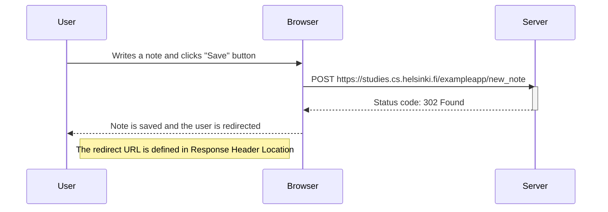

# 0.4: New note diagram

diagram depicting the situation where the user creates a new note on the page https://studies.cs.helsinki.fi/exampleapp/notes by writing something into the text field and clicking the _Save_ button.

---

- [🏠 Summary](../README.md)
- [➡️ Exercise 0.5](./exercise-0-5.md)
