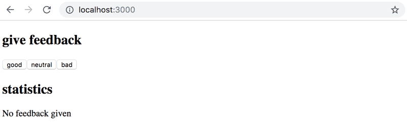
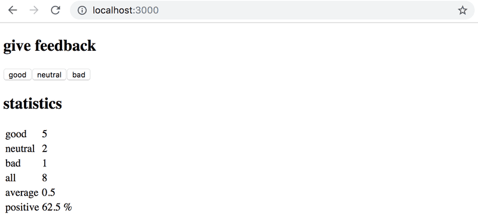

# Part 1 - Exercise Unicafe

- [Exercise 1.6: Unicafe, step 1](#step-1)
- [Exercise 1.7: Unicafe, step 2](#step-2)
- [Exercise 1.8: Unicafe, step 3](#step-3)
- [Exercise 1.9: Unicafe, step 4](#step-4)
- [Exercise 1.10: Unicafe, step 5](#step-5)
- [Exercise 1.11: Unicafe, step 6](#step-6)

## <a id="step-1"></a> Exercise 1.6: Unicafe, step 1

Like most companies, the student restaurant of the University of Helsinki Unicafe collects feedback from its customers. Your task is to implement a web application for collecting customer feedback. There are only three options for feedback: _good_, _neutral_, and _bad_.

The application must display the total number of collected feedback for each category. Your final application could look like this:


Note that your application needs to work only during a single browser session. Once you refresh the page, the collected feedback is allowed to disappear.

The `main.jsx` file is as follows:

```js
import ReactDOM from "react-dom/client";

import App from "./App";

ReactDOM.createRoot(document.getElementById("root")).render(<App />);
```

You can use the code below as a starting point for the `App.jsx` file:

```js
import { useState } from "react";

const App = () => {
  // save clicks of each button to its own state
  const [good, setGood] = useState(0);
  const [neutral, setNeutral] = useState(0);
  const [bad, setBad] = useState(0);

  return <div>code here</div>;
};

export default App;
```

## <a id="step-2"></a> Exercise 1.7: Unicafe, step 2

Expand your application so that it shows more statistics about the gathered feedback: the total number of collected feedback, the average score (good: 1, neutral: 0, bad: -1) and the percentage of positive feedback.


## <a id="step-3"></a> Exercise 1.8: Unicafe, step 3

Refactor your application so that displaying the statistics is extracted into its own `Statistics` component. The state of the application should remain in the `App` root component.

Remember that components should not be defined inside other components:

```js
// a proper place to define a component
const Statistics = (props) => {
  // ...
}

const App = () => {
  const [good, setGood] = useState(0)
  const [neutral, setNeutral] = useState(0)
  const [bad, setBad] = useState(0)

  // do not define a component within another component
  const Statistics = (props) => {
    // ...
  }

  return (
    // ...
  )
}
```

## <a id="step-4"></a> Exercise 1.9: Unicafe, step 4

Change your application to display statistics only once feedback has been gathered.



## <a id="step-5"></a> Exercise 1.10: Unicafe, step 5

Extract the following two components:

- _Button handles the functionality of each feedback submission button._

- _StatisticLine for displaying a single statistic, e.g. the average score._

To be clear: the `StatisticLine` component always displays a single statistic, meaning that the application uses multiple components for rendering all of the statistics:

```js
const Statistics = (props) => {
  /// ...
  return(
    <div>
      <StatisticLine text="good" value ={...} />
      <StatisticLine text="neutral" value ={...} />
      <StatisticLine text="bad" value ={...} />
      // ...
    </div>
  )
}
```

The application's state should still be kept in the root `App` component.

## <a id="step-6"></a> Exercise 1.11: Unicafe, step 6

Display the statistics in an HTML table, so that your application looks roughly like this:



---

[🏠 Summary](../../README.md)
