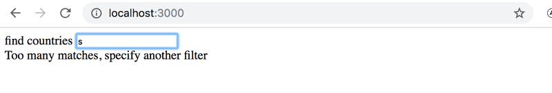
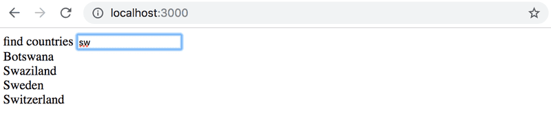
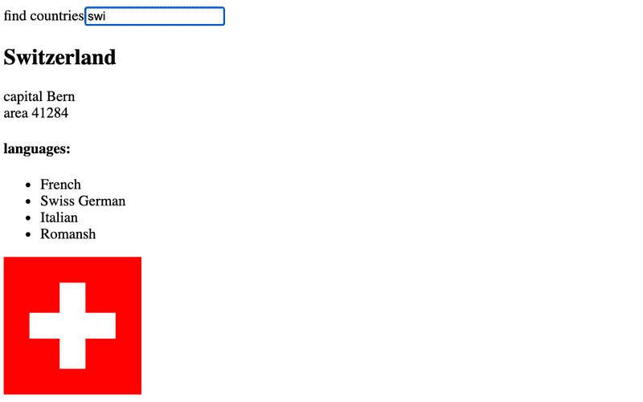
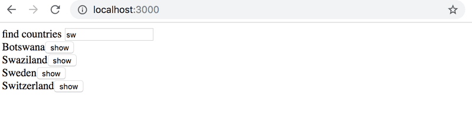
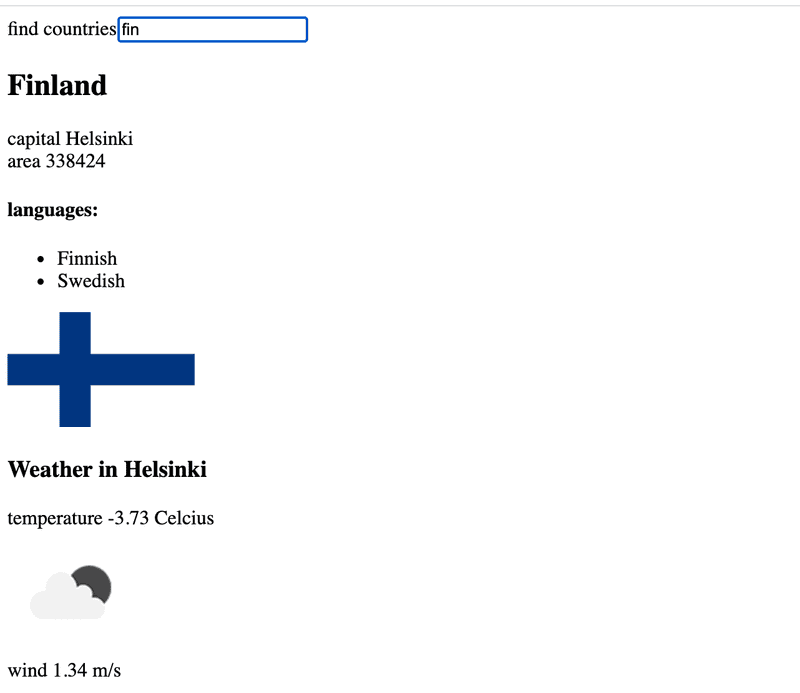

# Part 2 - Exercise Countries

- [Exercise 2.18: Countries, step 1](#step-1)
- [Exercise 2.19: Countries, step 2](#step-2)
- [Exercise 2.20: Countries, step 3](#step-3)

##  Exercise 2.18: Countries, step 1

At `https://studies.cs.helsinki.fi/restcountries/` you can find a service that offers a lot of information related to different countries in a so-called machine-readable format via the REST API. Make an application that allows you to view information from different countries.

The user interface is very simple. The country to be shown is found by typing a search query into the search field.

If there are too many (over 10) countries that match the query, then the user is prompted to make their query more specific:

If there are ten or fewer countries, but more than one, then all countries matching the query are shown:

When there is only one country matching the query, then the basic data of the country (eg. capital and area), its flag and the languages spoken are shown:

**NB:** It is enough that your application works for most countries. Some countries, like _Sudan_, can be hard to support since the name of the country is part of the name of another country, _South Sudan_. You don't need to worry about these edge cases.

##  Exercise 2.19: Countries, step 2

Improve on the application in the previous exercise, such that when the names of multiple countries are shown on the page there is a button next to the name of the country, which when pressed shows the view for that country:

##  Exercise 2.20: Countries, step 3

Add to the view showing the data of a single country, the weather report for the capital of that country. There are dozens of providers for weather data. One suggested API is https://openweathermap.org. Note that it might take some minutes until a generated API key is valid.

**NB:** You need an api-key to use almost every weather service. Do not save the api-key to source control! Nor hardcode the api-key to your source code. Instead use an [environment variable](https://vitejs.dev/guide/env-and-mode.html) to save the key.

---

[🏠 Summary](../../README.md)
