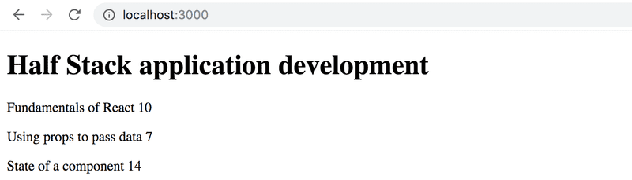
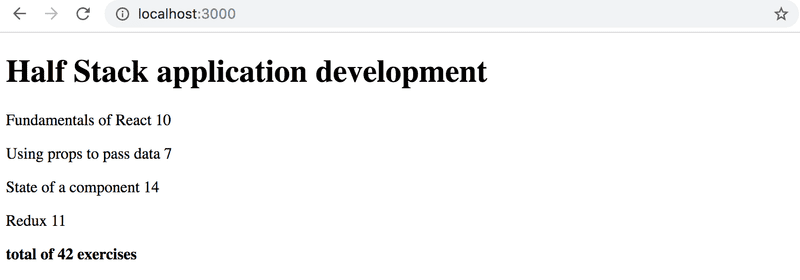

# Part 2 - Exercise Course Information

- [Exercise 2.1: Course Information, step 6](#step-6)
- [Exercise 2.2: Course Information, step 7](#step-7)
- [Exercise 2.3: Course Information, step 8](#step-8)
- [Exercise 2.4: Course Information, step 9](#step-9)
- [Exercise 2.5: Course Information, step 10](#step-10)

## <a id="step-6"></a> Exercise 2.1: Course Information, step 6

Let's finish the code for rendering course contents from exercises 1.1 - 1.5. Let's change the `App` component like so:

```js
const App = () => {
  const course = {
    id: 1,
    name: "Half Stack application development",
    parts: [
      {
        name: "Fundamentals of React",
        exercises: 10,
        id: 1,
      },
      {
        name: "Using props to pass data",
        exercises: 7,
        id: 2,
      },
      {
        name: "State of a component",
        exercises: 14,
        id: 3,
      },
    ],
  };

  return <Course course={course} />;
};

export default App;
```

Define a component responsible for formatting a single course called `Course`.

The component structure of the application can be, for example, the following:

```
App
  Course
    Header
    Content
      Part
      Part
      ...
```

Hence, the `Course` component contains the components defined in the previous part, which are responsible for rendering the course name and its parts.

The rendered page can, for example, look as follows:



You don't need the sum of the exercises yet.

The application must work **regardless of the number of parts a course has**, so make sure the application works if you add or remove parts of a course.

## <a id="step-7"></a> Exercise 2.2: Course Information, step 7

Show also the sum of the exercises of the course.



## <a id="step-8"></a> Exercise 2.3: Course Information, step 8

If you haven't done so already, calculate the sum of exercises with the array method reduce.

## <a id="step-9"></a> Exercise 2.4: Course Information, step 9

Let's extend our application to allow for an _arbitrary_ number of courses:

```js
const App = () => {
  const courses = [
    {
      name: "Half Stack application development",
      id: 1,
      parts: [
        {
          name: "Fundamentals of React",
          exercises: 10,
          id: 1,
        },
        {
          name: "Using props to pass data",
          exercises: 7,
          id: 2,
        },
        {
          name: "State of a component",
          exercises: 14,
          id: 3,
        },
        {
          name: "Redux",
          exercises: 11,
          id: 4,
        },
      ],
    },
    {
      name: "Node.js",
      id: 2,
      parts: [
        {
          name: "Routing",
          exercises: 3,
          id: 1,
        },
        {
          name: "Middlewares",
          exercises: 7,
          id: 2,
        },
      ],
    },
  ];

  return <div>// ...</div>;
};
```

The application can, for example, look like this:


## <a id="step-10"></a> Exercise 2.5: Course Information, step 10

Declare the `Course` component as a separate module, which is imported by the `App` component. You can include all subcomponents of the course in the same module.

---

[🏠 Summary](../../README.md)
