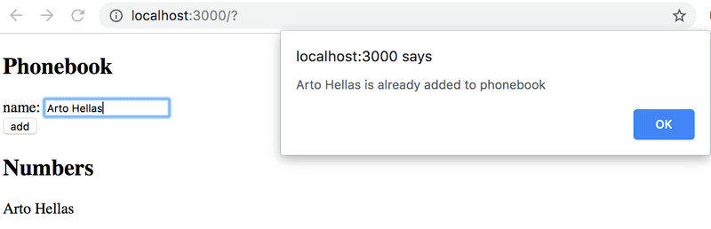
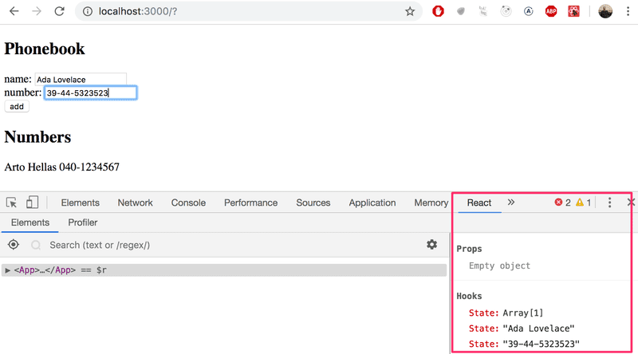

# Part 2 - Exercise Phonebook

- [Exercise 2.6: Phonebook, step 1](#step-1)
- [Exercise 2.7: Phonebook, step 2](#step-2)
- [Exercise 2.8: Phonebook, step 3](#step-3)
- [Exercise 2.9: Phonebook, step 4](#step-4)
- [Exercise 2.10: Phonebook, step 5](#step-5)

## <a id="step-1"></a> Exercise 2.6: Phonebook, step 1

Let's create a simple phonebook. **_In this part, we will only be adding names to the phonebook._**

Let us start by implementing the addition of a person to the phonebook.

You can use the code below as a starting point for the `App` component of your application:

```js
import { useState } from "react";

const App = () => {
  const [persons, setPersons] = useState([{ name: "Arto Hellas" }]);
  const [newName, setNewName] = useState("");

  return (
    <div>
      <h2>Phonebook</h2>
      <form>
        <div>
          name: <input />
        </div>
        <div>
          <button type="submit">add</button>
        </div>
      </form>
      <h2>Numbers</h2>
      ...
    </div>
  );
};

export default App;
```

The `newName` state is meant for controlling the form input element.

After finishing this exercise your application should look something like this:


Note the use of the React developer tools extension in the picture above!

**NB:**

- you can use the person's name as a value of the key property
- remember to prevent the default action of submitting HTML forms!

## <a id="step-2"></a> Exercise 2.7: Phonebook, step 2

Prevent the user from being able to add names that already exist in the phonebook. JavaScript arrays have numerous suitable methods for accomplishing this task. Keep in mind how object equality works in Javascript.

Issue a warning with the alert command when such an action is attempted:



**Hint:** when you are forming strings that contain values from variables, it is recommended to use a template string:

```js
`${newName} is already added to phonebook`;
```

## <a id="step-3"></a> Exercise 2.8: Phonebook, step 3

Expand your application by allowing users to add phone numbers to the phone book. You will need to add a second _input_ element to the form (along with its own event handler):

```js
<form>
  <div>
    name: <input />
  </div>
  <div>
    number: <input />
  </div>
  <div>
    <button type="submit">add</button>
  </div>
</form>
```

At this point, the application could look something like this. The image also displays the application's state with the help of React developer tools:



## <a id="step-4"></a> Exercise 2.9: Phonebook, step 4

Implement a search field that can be used to filter the list of people by name:


You can implement the search field as an _input_ element that is placed outside the HTML form. The filtering logic shown in the image is _case insensitive_, meaning that the search term _arto_ also returns results that contain Arto with an uppercase A.

**NB:** When you are working on new functionality, it's often useful to "hardcode" some dummy data into your application, e.g.

```js
const App = () => {
  const [persons, setPersons] = useState([
    { name: "Arto Hellas", number: "040-123456", id: 1 },
    { name: "Ada Lovelace", number: "39-44-5323523", id: 2 },
    { name: "Dan Abramov", number: "12-43-234345", id: 3 },
    { name: "Mary Poppendieck", number: "39-23-6423122", id: 4 },
  ]);

  // ...
};
```

This saves you from having to manually input data into your application for testing out your new functionality.

## <a id="step-5"></a> Exercise 2.10: Phonebook, step 5

If you have implemented your application in a single component, refactor it by extracting suitable parts into new components. Maintain the application's state and all event handlers in the `App` root component.

It is sufficient to extract **three** components from the application. Good candidates for separate components are, for example, the search filter, the form for adding new people to the phonebook, a component that renders all people from the phonebook, and a component that renders a single person's details.

The application's root component could look similar to this after the refactoring. The refactored root component below only renders titles and lets the extracted components take care of the rest.

```js
const App = () => {
  // ...

  return (
    <div>
      <h2>Phonebook</h2>

      <Filter ... />

      <h3>Add a new</h3>

      <PersonForm
        ...
      />

      <h3>Numbers</h3>

      <Persons ... />
    </div>
  )
}
```

**NB:** You might run into problems in this exercise if you define your components "in the wrong place".

---

[🏠 Summary](../../README.md)
